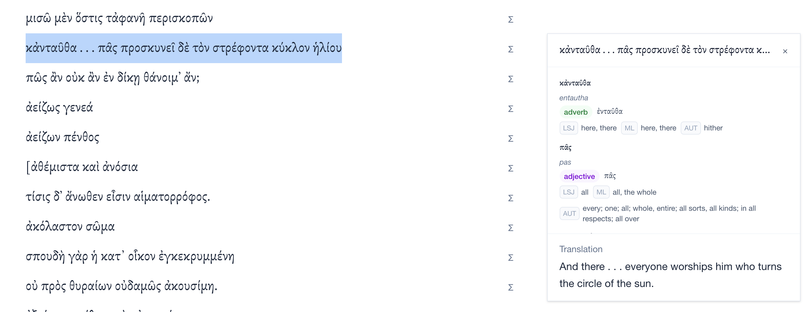
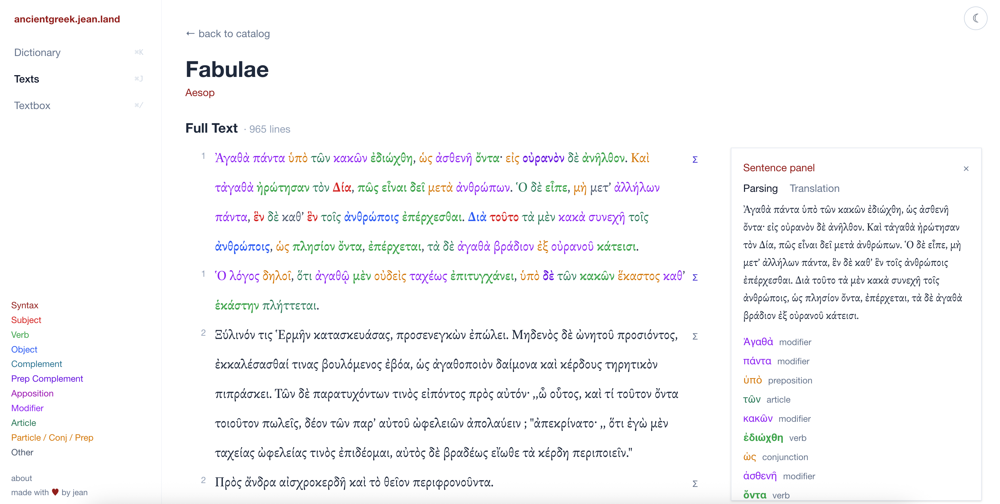
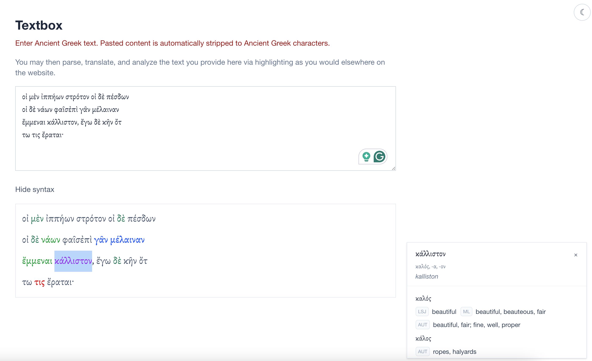
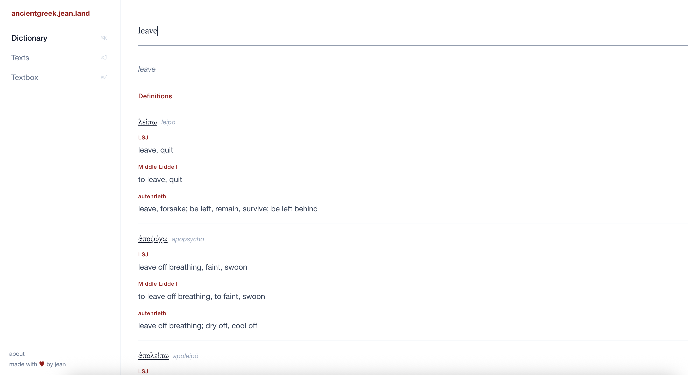

# ancientgreek.jean.land

**ancientgreek.jean.land** is a tool I made to help me learn ancient greek. It consolidates the wonderful open-source resources from [Logeion](https://logeion.uchicago.edu/), [Perseus](https://www.perseus.tufts.edu/hopper/), [Wiktionary](https://en.wiktionary.org/), and more, and provides several modernized learning tools that I found most helpful to me. 

**Asking for your help:** I'm extremely grateful for the warm responses I've gotten from social media. Running this will cost me $30/mo not including token costs for translation, and I would like it to be free access if I keep it up. Please consider Github Sponsor here
Main features:

* **In-text word lookup**: returns top-voted result from [Perseus](https://www.perseus.tufts.edu/) in popup form and/or dictionary result
* **One-stop shop dictionary:** basically [Logeion](https://logeion.uchicago.edu/) but with bilingual search + morphology tables from [Wiktionary](https://en.wiktionary.org/)
* **Complete sentence parse + translation**: select any text to see meaning of each word + gemini-flash translation into English
* **Syntax parsing**: highlight parts of speech with [odycy](https://centre-for-humanities-computing.github.io/odyCy/index.html) for any sentence
* **User-provided text**: paste any ancient greek text to start using the above features on the text

Sources:

* Dictionaries: [Logeion](https://logeion.uchicago.edu/index.html) and [Wiktionary](https://en.wiktionary.org/). All diacritical marks are retained from Wiktionary except where short vowels are as ᾰ. Attic Greek is prioritized, and contracted are displayed over uncontracted.
* Texts: [PerseusDL](https://github.com/PerseusDL/canonical-greekLit), [OpenGreekAndLatin](https://github.com/OpenGreekAndLatin/First1KGreek), [Online Critical Pseudepigrapha](https://github.com/OnlineCriticalPseudepigrapha/Online-Critical-Pseudepigrapha) (everything used to pretrain odycy!)
* Syntax: [odycy](https://centre-for-humanities-computing.github.io/odyCy/index.html)
* Typeface: optional local [Brill](https://brill.com/page/510269?srsltid=AfmBOoo9tJZ3rMdmnFzupGDeHeVBqPQ8PazPbQ7U4rUrOAtgsQArZFt0) install, otherwise `Gentium Plus` / `Noto Serif`
* **All translations use gemini-flash via OpenRouter and I'm currently paying for tokens out of pocket. I've capped the spend at 10 dollars and I'll replace it with another model down the line.**


Demos:







## current shape of the app

- Frontend tabs: `Dictionary`, `Texts`, `Textbox`, `About`
- Backend routers: `/api/dictionary`, `/api/texts`, `/api/health`
- No chat tab/router in the current codebase
- `Brill` is not included here. without local Brill install font falls back to `Gentium Plus` / `Noto Serif`

## run locally
 
```bash
# backend
uv run uvicorn backend.main:app --reload --port 8000

# frontend
cd frontend
npm install
npm run dev
```

Then open the Vite URL (usually `http://localhost:5173`).

## env vars you likely need

Create `.env` in repo root:

```bash
OPENROUTER_API_KEY=...
TRANSLATE_MODEL=google/gemini-2.5-flash
LSJ_FULL_S3_URI=s3://ancientgreek/dictionaries/lsj-full.json
```

`LSJ_FULL_S3_URI` is used to pull the large LSJ file when it is not present locally.

## notes

- Selection popups use local dictionary/parse endpoints only.
- Live Logeion calls happen when opening dictionary entries.
- Latin dictionary entries are filtered out of the live Logeion view.

For deployment details (Lightsail + Nginx + systemd), see `DEPLOY_LIGHTSAIL.md`.

If you want to use Brill locally without committing the font files, see `frontend/public/fonts/README.md`.
