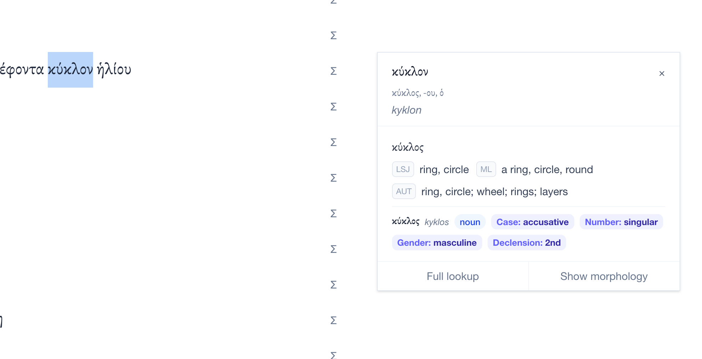

# ancientgreek.jean.land

**ancientgreek.jean.land** is a tool I made to help me learn ancient greek. It consolidates the wonderful open-source resources from [Logeion](https://logeion.uchicago.edu/), [Perseus](https://www.perseus.tufts.edu/hopper/), [Wiktionary](https://en.wiktionary.org/), and more, and provides several modernized learning tools that I found most helpful to me. 

**Disclaimer:** I started learning Ancient Greek like 4 weeks ago, and I made this with AI code agents and paid for the tokens myself over two days after work. Please excuse any mistakes. It cost me <$150 to make this in under 24 hours.

For errors or suggestions, please write to me at [jean@semiote.ch](mailto:jean@semiote.ch). For more projects pls visit my personal website at [jean.land](https://www.jean.land/).

**Asking for your help:** I'm extremely grateful for the warm responses I've gotten from social media. Running this will cost me $30/mo not including token costs for translation, and I would like it to be free access if I keep it up. If you are interested in helping out with money, structure, or tokens, [lets talk](mailto:jean@semiote.ch).

Main features:

* **In-text word lookup**: returns top-voted result from [Perseus](https://www.perseus.tufts.edu/) in popup form and/or dictionary result
* **One-stop shop dictionary:** basically [Logeion](https://logeion.uchicago.edu/) but with bilingual search + morphology tables from [Wiktionary](https://en.wiktionary.org/)
* **Complete sentence parse + translation**: select any text to see meaning of each word + gemini-flash translation into English
* **Syntax parsing**: highlight parts of speech with [odycy](https://centre-for-humanities-computing.github.io/odyCy/index.html) for any sentence
* **User-provided text**: paste any ancient greek text to start using the above features on the text

Sources:

* Dictionaries: [Logeion](https://logeion.uchicago.edu/index.html) and [Wiktionary](https://en.wiktionary.org/). All diacritical marks are retained from Wiktionary except where short vowels are as ᾰ. Attic Greek is prioritized, and contracted are displayed over uncontracted.
* Texts: [PerseusDL](https://github.com/PerseusDL/canonical-greekLit), [OpenGreekAndLatin](https://github.com/OpenGreekAndLatin/First1KGreek), [Online Critical Pseudepigrapha](https://github.com/OnlineCriticalPseudepigrapha/Online-Critical-Pseudepigrapha) (everything used to pretrain odycy!)
* Syntax: [odycy](https://centre-for-humanities-computing.github.io/odyCy/index.html)
* Typeface: optional local [Brill](https://brill.com/page/510269?srsltid=AfmBOoo9tJZ3rMdmnFzupGDeHeVBqPQ8PazPbQ7U4rUrOAtgsQArZFt0) install, otherwise `Gentium Plus` / `Noto Serif`
* **All translations use gemini-flash via OpenRouter and I'm currently paying for tokens out of pocket. I've capped the spend at 10 dollars and I'll replace it with another model down the line.**

Demos:

